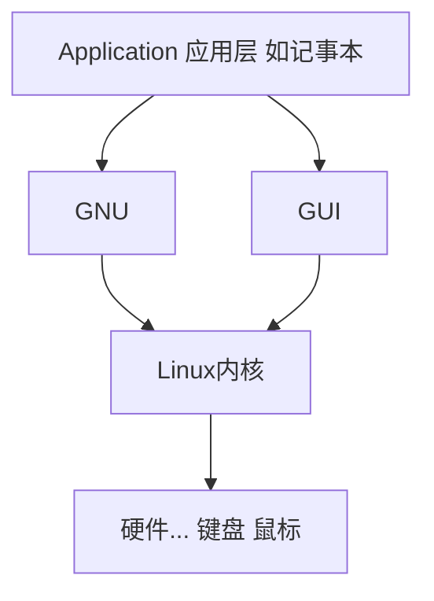

# Linux系统


## python

`python3`: 打开交互模式

`ipython3` 更高端的交互模式   python和bash的语法好像都能用？

`python+ 文件名` 运行该python文件


## gcc

### 安装gcc编译器

```shell
sudo apt update
sudo apt install build-essential
# 安装相关说明文档
sudo apt-get install manpages-dev
# 查看gcc版本
gcc --version

# 这些命令是安装在相应Linux发行版之下的gcc适用版本，不一定是最新的
```


### 安装我们想要的gcc编译器版本

```shell
sudo apt install gcc-10
```


### 修改默认的gcc版本

> 若安装了多个gcc的版本，则使用如下命令修改默认的gcc版本

```shell
sudo update-alternatives --config gcc
```


### 利用gcc编译执行文件

```shell
# 创建一个.c文件
touch demo.c

# 编辑.c文件
gedit demo.c

gcc demo.c -o demo # 将demo.c文件编译成二进制文件

# 执行二进制文件
./demo
```


### 查看当前系统中的环境变量

```shell
set
```


### 通过gcc编译openmp程序

```shell
gcc -fopenmp hello_omp.c -o hello_omp
./hello_omp
```


## ubuntu2004x64

### 一些命令

tar.gz   压缩文件命令

touch 1.txt   创建文件命令

df -T    查看分区


安装vim

```shell
sudo apt-get install vim
```


### 安装VMware Tools

1. 将tar.gz拷贝到桌面

2. 在桌面右键，点击open in terminal

3. 输入命令    **tar zxvf** VM(tab补全，或者输入该文件名)、

   解压缩命令

4. `ls` 

5. `cd vm(tab补全)` 进入到该文件夹

6. `ls` 展示其中所有的文件

7. `sudu ./vm(tab)` (注意是句号右边的斜杠)

8. 输入密码   回车    yes    

9. 安装完成  重启   命令    `reboot`


## Linux其他发行版

若要想安装Linux的其他发行版，如kali，而新建虚拟机中没有，则有两种方法

1. 找它是基于什么的，然后安装它基于的系统
2. 找它的LInux内核的版本，安装相应的Linux内核


centos


## 步入Linux的世界

GNU：/g$e$nu:/

全称：GNU/Linux

四个部分：

1. Linux kernel 内核
2. GNU工具
3. GUI Desktop环境
4. Application 应用

为Linux编写了很多有趣的软件    属于GNU


### Linux系统组成




### Linux内核

> 操作系统

1. 硬件设备  管理使用   适配所有的键盘  主板  
2. 软件程序（系统）-->  操作软件    进程管理
3. 内存管理
4. 文件管理  保存文件  删除文件  修改文件


#### 文件系统

读，写的标准

不同的读写标准会有不同的结果（影响）

windows上用的文件系统：NTFS

Linux文件系统：ext   ext3 ext2  ext4  hpfs   iso9660 JFS  minix  msdos  ncpfs  nfs   ntfs   proc   Reiserfs  smb  sysv  umsdos  vfat  XFS  xiafs


通常Linux系统使用ext4，引导使用vfat


U盘   FAT32  单个文件4G以上不支持    必须要把U盘格式化成NTFS          exFAT闪存常用


#### GNU

> 也是一个组织

**Unix** 上具有的一些软件，Linux 内核本身没有， 所以GNU他们模仿Unix，为Linux 写了一些必要的软件

1. GNU核心：原本在Unix上的一些命令和工具，被模仿（移植）到了Linux上

   供Linux 使用的这套工具：coreutils   coreutilities  a  软件包

   用处：

   1. 用来处理文件的工具
   2. 用来操作文本的工具
   3. 用来管理进程的工具

2. shell

   提供给用户使用的软件：用户拿他来使用电脑，并且和电脑交互

   命令行shell提供一个**命令行界面**（CLI），而图形shell提供一个**图形界面**（GUI）

   即  Linux shell  -> CLI（Command-Line Interface）

shell 和 Linux一起组成了Linux系统


## CLI shell


bash shell  基础的shell    macos上也使用bash shell  

还有zsh    zsh包含下面三个

  ash  korn  tcsh  等等

oh my zsh 项目


# Bash shell命令


## ls命令及其引申

tty  打字机 teletype writer

终端  terminal  仿真器

win 当中的shift   linux中是alt

要调必须调成等宽字体

```shell
ls  #显示当前目录下的所有文件夹和文件（不包括隐藏文件）

ls -a #会显示带点的隐藏文件  注意命令之间的空格不能少
ls -1    #竖着排列所有文件
ls -l    #显示长列表，文件的更详细的信息，这里显示的时间是最新的修改时间
ls --time=atime -l  # 这里显示的时间是最新的访问时间
ls -hl    #按k排列
ls -a1    #竖着排列所有文件的详细信息
ls -m    #水平输出所有文件
ll  #显示所有文件的详细信息（包含隐藏文件）
ls -l -a  #缩写是ll
ls -R    #递归显示文件   多级树结构
ls -ltr   #按照修改时间进行排列
ls --color=auto   #根据颜色进行分类
ls Documents/ -F -R   #/F区分文件夹和文件    /R 把他们进行重新遍历
ls -alF
```

若`ls` 遍历之后，文件名带了单引号`''` ，是linux系统把它当作一个副本了，认为它是复制来的


用户名@计算机名:当前所在目录     linux允许多个用户在一个计算机上进行操作，这样可以知道谁操作了这条命令

远程用户登录：  用户名@IP地址名（服务器名）


$\sim$ 当前用户home目录    打开terminal默认跳到用户目录

$  等待用户输入

```shell
man ls    #查看ls命令帮助文档
```

蓝色的是文件夹，白色的是文件     .开头的是隐藏文件或文件夹

```shell
clear   #清屏
ctrl+l   #清屏
```


### ls高级用法：过滤

文件扩展匹配   `?` `*`   

`ls -l fhs-2.3_*.pdf` 

`ll fhs-2.3_*.pdf` 

 系统会展示出所有的名字为`fhs-2.3_XXXXXXXXX` 的文件，`*` 代表**任意的**，可能为多个字符；`?`代表一个占位符号

中括号   元字符通配符`[a-z]`    范围匹配    括号里还可以加`!`  表示该范围之外的


## Linux目录

**Linux一切皆文件**   系统驱动  都是文件

\   反斜线   Windows

/   正斜线   Linux

cd /    切换到Linux的最根目录  站在最高顶处  看到了所有的文件和文件夹  包括用户目录（home）

当前文件的位置： `$` 之前就是当前的位置


- `/`   根目录

- `home`  主要目录，显示所有用户目录， 一般都在这里操作

- `/bin`  二进制目录  GNU的一些工具  系统用的一些命令都在/bin目录下      存放许多用户级

- `cd ..`  切换到上一个目录

- `/cdrom`  光盘文件

- `/etc`  系统配置文件目录     windows中的注册表， C盘里的windows文件夹等，里面也是配置文件

- `/lib`  库目录，存放系统应用程序的库文件

- `lost + found`  断电了，或者意外突发情况，创建的临时文件等，可能在这里

- `/mnt`  挂载目录   用于临时挂载文件系统的挂载点   硬盘，U盘，手机等插在电脑上时，这里会有一个相关的东西

  挂载---外在的设备和电脑进行连接

- `/proc`  虚拟文件系统   伪文件系统

- `/run`  运行目录   临时运行目录   比如运行一个firefox，系统会把相关的临时文件放在这里，关闭后会删除（也可能不删除）

- `/sanp`  ubuntu特有的  软件打包系统

- `/tmp`  临时目录，放一些临时的工作文件（/temp）    黑客重要信息放在这里？？

- `/var`  可变目录，存放一些变化的文件    log

- `/boot`  启动目录   系统启动的时候在干嘛，都放到boot里   一但动boot里的东西，电脑可能开不开机了

- `/dev`  设备目录   创建一些设备节点    类似于windows中的**设备管理器**

  特殊目录    

- `/media`  媒体目录  可移动媒体的挂载点   MP3等挂载设备media里找不到，就到mnt中去找

- `/opt`  可选目录   存放一些第三方的软件包，数据     比如在lunux中安装qq，微信等

- `/root`  管理员的文件夹，root用户的主目录    linux上为了保证系统的安全，把home目录和root目录分开了

  root用户具有修改电脑上所有文件的权限，包括删除

  删库命令 ：`sudo rm -rf /*`    sudo就是调用管理员身份，输入密码后就能删除了

  进入管理员文件夹：`su` 

- `/sbin`  系统二进制目录，存放GNU中的高级管理员使用的命令工具

- `/srv`  服务目录 本地服务  如windows中mysql的服务，在Linux中就在这个文件夹下

- `/usr`  用户二进制目录   普通用户使用的GNU工具
  自己安装的一些软件的命令，如自己安装的python啊，gcc啊，这些命令，到`/usr/bin`  里面找

FHS文件系统层级标准   在centos上，kali上等等

`pathname.com/fhs`  网站   所有的目录的标准  都在这里


## cd命令

> 切换用户当前工作目录

- `cd ~`  转到用户文件夹
  `cd`  直接cd也行，回到用户目录
- `cd ..` 返回上一层目录
- `cd ../..` 返回上上一层目录
- `cd /` 进入根目录
- `pwd`  显示当前的目录（绝对路径）
- `^C` 终止当前命令的执行
- `ctrl + shift + c`  复制
- `cd -`  打印出上一次执行命令的目录

Linux没有撤销的概念，输入的命令不能撤销


## 文件目录

1. 绝对路径

   最全的

   windows上的绝对路径     盘符：\文件夹\...\文件名.文件后缀

2. 相对路径

   相对路径一定要设置故事背景：**我在哪？**    **相对于谁？**

   我在上海，那么微软研究院路径这么写：北京市海淀区中关村丹棱路5号微软大厦2楼12-14层微软研究院（写到北京市）

   我在北京，那么要这么写：海淀区中关村丹棱路5号微软大厦2楼12-14层微软研究院（写到海淀区就行了）

   我在朝阳区，那么这么写：海淀区中关村丹棱路5号微软大厦2楼12-14层微软研究院（也要写到海淀区，因为你在朝阳区）

```shell
gedit /home/white/Documents/doc/1.txt
```

**操作相对路径时，不要带最前面的/**，因为已经在上一级文件的里面了

```shell
gedit Documents/doc/1.txt
```

若加上/，Linux会认为它是根目录，要操作的是根目录下的Documents,但是根目录下没有Documents文件夹，所以Linux会创建一个临时文件，若此时你保存，系统会说找不到该路径下的该文件

如果前面加/，Linux会认为这是一个绝对路径（/是根目录）

但是也可以这样

```shell
gedit ./Documents/doc/1.txt
```

这个也表示相对目录，`.` 表示当前目录，若此时在`~`  目录下，则可以执行。这条命令表示：当前文件夹下的Documents文件夹

甚至这样

```shell
gedit ~/Documents/doc/1.txt
```

这是个绝对路径，表示用户文件夹下的Documents文件夹


单点符`.`  当前文件夹

双点符`..`  当前目录的父目录

`ls`  后面也可以跟目录，查看该目录下的文件夹


## 创建文件夹

- `&&`  并且  同时执行多条命令

- `touch 2.txt`  创建一个空的文本文件   同时可以更改一个文件的显示时间

  若使用`ll` 命令，显示的时间是最后一个更改该文件的时间

  若`touch `  一个已经存在的文件，**只是更新时间**，数据还在，而不是覆盖


## 复制文件（夹）

`cp`  命令

`cp`  源文件  目标文件

`cp`  你想复制的文件？  你想复制到哪？

`cp 1.txt 2.txt`  

- 若该文件夹目录下没有`2.txt` 文件，则创建一个，内容一样
- 若该文件夹目录下有`2.txt` 文件，则会‘覆盖

但这种命令非常危险，企业里绝对不允许，因为可能会覆盖掉一些信息

所以**强制要求**：

`cp -i 1.txt 2.txt`  加了一个-i  ，意思就是若文件已存在，覆盖之前先询问用户


复制文件夹  写绝对路径或者相对路径

`cp /home/white/Documents/doc/* /home/white/Downloads` 这条命令把doc文件夹下的**所有文件**都复制到`Downloads` 下，但是没有复制`doc` 文件夹

`cp -r`  **将指定目录下的所有文件和子目录一并处理**   连同该文件夹下的所有目录，都复制过去

`cp -i 1.txt ~/Downloads`  将文件复制到另一个文件夹

`cp -i 1.txt ../`  将文件复制到上一级目录

`cp -r ~/Music/Jack ~/Documents/doc`   连同Jack中的所有文件，将Jack文件夹复制到doc文件夹下    Jack后面加不加/无所谓。当然，这些目录也可以使用相对路径

`cp -r ../Jack ~/Documents/doc/`  在Jack文件夹下想要复制Jack文件夹，必须先退出到上一级，再进行操作


## 光标移动快捷键

`tab` 可以进行补全

`ctrl + 方向键`  可以跳跃单词，比较快速

`ctrl + a`  直接跳到这个命令的开头

`ctrl + e`  跳到命令的结尾

`ctrl + b`  往前移动一个小格

`ctrl + h`  往前删除一个字符   与退格键一模一样

`ctrl + f`  往后移动一个小格

`ctrl + t`  将光标前面的一个字符向后移动一个小格，后面的字符往前移动一个小格

`ctrl + u`  删除本条命令光标之前的所有命令

`ctrl + k`  删除本条命令光标之后的所有命令

`ctrl + r`  搜索之前用过的命令    不太明白？？

`ctrl + p`   和  `ctrl + n`   作用和上下键的作用一样

`ctrl + j`  和回车等价


## lnk文件

`.lnk`  链接文件

在linux中分为两种

1. 符号链接（symbolic）软链接    就是快捷方式
   原来的文件/文件夹必须是存在的
2. 硬链接
   创建副本     原来的文件/文件夹必须是存在的

演示：使用如下两条命令创建两个文件

`ln -s 1.java 1_linkfile`   创建软链接

`ln 1.java 2_linkfile`   创建硬链接

 当输入`ll` 命令之后，显示如下


可以发现，`1_linkfile` 文件的大小为6个字节，而本来`1.java` 的大小为0，足以证明`1_linkfile` 与`java` 不是一个文件，`1_linkfile` 是一个单独的快捷方式文件（上面的指针，箭头也表明了这一点）。而`2_linkfile` 的大小也是0，类似与一个副本。

一般情况下，企业里软链接用的比较多，`ll` 命令可以直接看到

硬链接只能在同一个介质里，同一块硬盘内创建

不同存储媒质之间的链接，我们只能使用软链接，软链接比较强一点

菜鸟教程当中两者的区别：

- 软链接
  1. 以路径的方式存在，类似于windows操作系统中的快捷方式
  2. 软链接可以跨文件系统，硬链接不可以
  3. 软链接可以对一个不存在的文件名进行链接
  4. 软链接可以对目录进行链接
- 硬链接
  1. 以文件副本的形式存在，但不占用实际空间
  2. 不允许给目录创建硬链接（只能指向文件，不能指向文件夹）
  3. 硬链接只有在同一个文件系统中才能创建

在linux中，不论是什么文件都会分配一个编号，称为索引节点号（Innode Index）。在Linux中，多个文件名指向同一索引节点是存在的，一般这种链接就是硬链接。硬链接的作用是允许一个文件拥有多个有效路径名，这样用户就可以建立硬链接到重要文件，以防止“误删”。因为对应该目录的索引节点有一个以上的链接，只删除一个链接并不影响所以你节点本身和其他的链接，只有当最后一个链接被删除后，文件的数据块及目录的链接才会被释放。也就是说，文件真正删除的条件是与之相关的所有硬链接文件都被删除。

`ls -li` 使用`-i`  参数可以查看文件的`innode index`   硬链接文件与原文件的`innode index` 相同，而软链接文件与原文件的不同


如果使用`cp` 命令复制一个软链接会有什么情况？（相当于复制了一个快捷方式，把一个快捷方式发给你朋友了）

不要创建链接文件的软链接，相当于创建快捷方式的快捷方式，可能会造成连接混乱


## mv命令

> 移动（剪切）或者重命名文件

`mv 老文件  新文件`  重命名文件

`mv 文件（夹） 路径`     移动（剪切）文件（夹） 

`cd !$`  执行上一条命令的最后一个路径

`mv`  命令不能遍历，也就是没有`-r`  这个参数


## 删除命令

业界有一条极其危险的命令（够你在监狱里蹲几十年）

```shell
sudo rm -rf /*
```

`rm`  Linux中不建议直接使用`rm` 删除一个文件，因为它没有回收站这个概念，就是直接删除了

`sudo`  命令是 临时使用管理员身份，需要输入密码

`su`  是进入管理员身份

`rm -r` 遍历删除，删除该目录下的所有子目录（删除文件夹）

`rm -f`  强制删除，不再还原 使用`-f` 后再使用`-i` 也**不会提示**，而是直接删除

`rm -i` 确定删除吗？会问你一声   rm最好用什么参数？就是它


## 目录操作（文件夹）

`mkdir`  创建文件夹命令

`mkdir -p js/src/util`  创建子目录

`rmdir`  只能删除空目录  文件夹下有东西，删除不了   基本是一个废命令

`rm -ri`  一般删除还是用这个   

`find` 命令非常复杂，比如，在`project` 文件夹下有一个`java` 文件，里面有`1.java,2.java...` ，`java` 文件夹下还有一个`doc` 文件夹，里面还有`3.java,4.java`  ，要想找到`java` 目录下的`*.java` 文件，`cp` 命令已经不能满足我们的要求，于是我们要使用`find` 命令


## 查看文件

`FLAC` 无损的音频格式

查看文件的前提：知道文件的格式

`file`  命令，查看文件**编码格式**和**文件格式**

  或者展示  这是一个文件夹              理解为一个查看文件格式的命令


`cat`  查看文件内容（用于比较短的一些东西）

`cat -A` 显示所有内容（包括空格，tab键）   回车就是$\$$ ,tab键就是`^I` 

`cat -n` 给所有行编号


`more`  显示文件内容，每次显示一屏   `b` 显示上一页，`空格` 显示下一页，`q` 退出， `enter` 是向下翻一行


`less` 分屏上下翻页浏览文件内容

想要搜索时，直接`/+想搜索的内容` 就可以帮你搜索


但是，若是其他格式的文件，如音乐文件，视频文件，这种操作就相当于windows中以记事本打开


`tail`  在屏幕上指定文件的末尾若干行（默认十行）   如看`log` 文件一般都看最后几行，最近的记录

`tail -n 2 1.java`  只想看后面两行，使用`-n` 参数

`tail -v 1.java`  输出文件名

`head`  显示文件的开头部分   参数与`tail` 相同


# 更上一层的shell命令


## 任务管理器

`top`  显示或管理执行中的程序

`ps`  （process status）报告当前系统的进程状态   显示当前在终端里干了什么   显示当前用户

`ps -aux | grep named`  查看named进程详细信息    非常实用  `ps -aux | gerp gedit`  名字为`gedit`(记事本)的进程，查看其信息

`kill + PID` kill一个进程


`PID`  每一个进程，系统都给它分配一个进程号，每时每刻都是不同的

参数太多了讲不完，所以以后如果要用到有关进程的命令，先去看一下`ps` 的参数，说不定会派上用场


## 挂载

插上U盘，电脑创建一个虚拟的H盘，可以供用户操作，供用户使用计算机操作系统的文件系统访问，这样一个过程，就叫做挂载

计算机关机时，每个挂载的存储都将经历一次卸载，以确保所有排队的数据被写入

D盘，C盘等硬盘，也叫挂载，只不过是系统的挂载

那么问题来了：插入U盘时，在Linux中，它的目录在哪呢？

在根目录下的media，white，USB

更改盘符：磁盘管理  修改盘符路径


`mnt` 分区，是自动挂载点，不允许用户写入权限

`sudo fdist -l`  查看当前系统的磁盘分区情况，当前电脑上查了多少个硬盘设备  在**device** 下查看当前设备的真实目录（挂载点），若是USB则默认挂载点在media，现在我们通过以下命令改变它的默认挂载目录

`mount + 真实挂载目录 + /mnt`  可能还要加上`sudo `

如：`sudo mount /dev/sdc1 /mnt`，改变挂载目录后，原来的挂载目录的文件还存在，只是在新的挂载点也有了新的文件。而且这个`/dev/sdc1`这个目录无法访问，`cd`进入dev后，全是黄色的，没有访问权限。**本质上，这个U盘的真实路径在/dev/sdc1这里，但是默认挂载到了media那里**，但是我们可以使用mount，通过它的真实路径来修改挂载点

`sudo umount /mnt`  卸载目录

可以任意找一个地方去挂载它，甚至可以把它卸载，但是原本自动挂载的目录，你是不能把它卸载的（若有任意一个程序在使用它，甚至是终端在使用---在终端使用的意思是，目前在该目录下（在USB目录之下）） 

把一个分区挂载到一个目录上？？，而不是把一个目录挂载到一个目录上


`df -h`  查看当前挂载

目前已经基本实现自动挂载，但是若没有自动挂载，则需要手动挂载

不同的文件夹有不同的权限，若挂载的地方不能写入文件，只能拷贝，所以此时要更改挂载点，以便能够往里写入文件


### 安卓挂载

在linux电脑上操作安卓手机，需要`adb`工具，由于安卓手机挂载遵循`mtp`协议，故不能随意更改其挂载点


`df`命令，显示已经挂载的磁盘的使用情况   常用！

`df -h`以G，M为单位来显示磁盘存储空间

`du -u`查看当前目录的磁盘使用情况

`du -s`  --summarize    仅显示总计，只列出最后加总的值。


## sort

> 只能对文本文件进行排序

将文本文件文件内容排序显示


直接sort是按照字符的规则进行排序


`sort -n` 参数n，按照数字大小进行排序


`sort -nr`倒叙，按数字大小排列


**非常常用**：`sort -M` 按照年月日进行排序查找，缩写也可以查到

查看密码文件：`cat /etc/passwd`


很骚的一个命令：

`du -sh * | sort -nr`，效果如下：


# 软件安装

package management system  PMS   软件安装，更新，卸载    包管理系统    

很恶心的是：不同的Linux发行版有不同的PMS包管理系统，因为不同的Linux发行版没有统一包管理系统

为什么要配备国内镜像源？因为国外的镜像源，在安装软件的时候，速度会比较慢。

工具依赖：某一个应用程序依赖于某一个程序

qq  QQ空间  属于工具依赖，QQ空间依赖于qq

比如，装一个英雄联盟，就必须要装wegame一样（但这不是真正的工具依赖，因为安装英雄联盟也不一定要安装wegame）

这种工具依赖，**早期在Linux上是不能处理的**   比如，在Linux上装了一个QQ空间，但是它没有提示我要装qq，要申请qq号   

这种情况只有PMS可以处理 ,PMS可以自动配置环境变量    PMS在各个Linux发行版中可能不一样


### 两个工具

#### 包管理核心

##### `dpkg`  :

 如ubuntu  基于Debian 

- `apt-get`

- `apt-cache`

- `aptitude`   

  使用这个命令，可以解决工具依赖问题，但由于没人维护，20.04已经将其移除

`apt-get moo` 屏幕上显示一头牛


##### `rpm` 


red hat

 

yum  类似apt

`yum install xxxx`


### 想安装软件

就直接运行如下命令

`sudo apt install `  sudo是管理员身份

`apt list`  可安装的软件列表

#### 一些好玩的应用

`sl`

`cmatrix`


# 


### 更新软件

`update`

`upgrade`

**可简单的理解**为**前者是更新整个仓库的版本信息**，后者是**升级软件包**

安装软件之前, 可以不upgrade, 但是要update. 因为旧的信息指向了旧版本的包, 但是源的服务器更新了之后旧的包可能被新的替代了, 于是你会遇到404...

[Linux](https://so.csdn.net/so/search?from=pc_blog_highlight&q=Linux) 和 Windows 不一样，同一发行版（比如 Ubuntu) 的不同版本（比如 14.04, 14.10 ）用的软件仓库是不一样的，所以有仓库 (repository ) 这样的概念，自然就有了要更新仓库信息的逻辑。
你如果不更新仓库信息， upgrade 就在本地的旧仓库转悠一圈发现并没有要更新的，但实际上本地仓库已经过时了。

先用update，再用upgrade


### 卸载软件

`sudo apt remove `  


## 安装第三方软件

PMS系统中不含有这个软件，该怎么安装


### thefuck

自动提示纠错命令项目

PMS解决了版本依赖问题，但是若想要从第三方安装软件，我们必须手动处理这些依赖，安装其requirements

可以通过apt获取的还好，但是有的依赖apt也获取不了


homebrew  苹果电脑专门的包管理器


#### ubuntu安装命令

```shell
sudo apt update
sudo apt install python3-dev python3-pip python3-setuptools
pip3 install thefuck --user
```

若pip3命令较卡，则临时使用镜像源

```shell
pip3 install xxxx -i https://pypi.tuna.tsinghua.edu.cn/simple
```


```
deb http://mirrors.aliyun.com/ubuntu/ trusty main restricted universe multiverse  
deb http://mirrors.aliyun.com/ubuntu/ trusty-security main restricted universe multiverse  
deb http://mirrors.aliyun.com/ubuntu/ trusty-updates main restricted universe multiverse  
deb http://mirrors.aliyun.com/ubuntu/ trusty-proposed main restricted universe multiverse  
deb http://mirrors.aliyun.com/ubuntu/ trusty-backports main restricted universe multiverse  
deb-src http://mirrors.aliyun.com/ubuntu/ trusty main restricted universe multiverse  
deb-src http://mirrors.aliyun.com/ubuntu/ trusty-security main restricted universe multiverse  
deb-src http://mirrors.aliyun.com/ubuntu/ trusty-updates main restricted universe multiverse  
deb-src http://mirrors.aliyun.com/ubuntu/ trusty-proposed main restricted universe multiverse  
deb-src http://mirrors.aliyun.com/ubuntu/ trusty-backports main restricted universe multiverse
```


# vim

linux常见编辑器

vi  nano  （前俩基本是unix） **emacs（神之编辑器）  vim（编辑器之神）**  命令版的编辑器

vi improved   ----vim


### 安装vim

```bash
sudo apt install vim
```

在Centos里显示的可能是vi


## vim操作

`v` 选中一行

`<` 代码左移

`>` 代码右移


`ctrl+n` 就会补全代码

`ctrl + s` 停止输入

`ctrl + q` 继续输入

`i` 进入输入模式

`Esc` 进入命令模式

命令模式下`:wq` 保存并退出

`行号+G` 快速跳到某一行 

`yyp` 复制本行所有内容

`A` 从命令模式进入编辑模式，跳到这一行的行末

`i` 使用i从命令模式进入编辑模式，光标在目前位置进行输入

`I` 跳到这一行的行首，直接进行编辑

`V` 选中

`d` 剪切

`p` 粘贴   都是在命令模式下

`u`  撤销

`vim xxxx +10` 打开该文件并快速定位到第十行

`dd` 删除当前整行

`dw` 从当前光标开始算起，第一个单词删掉

`r+代替换的字母` 将当前光标下的字母替换为要替换的字母